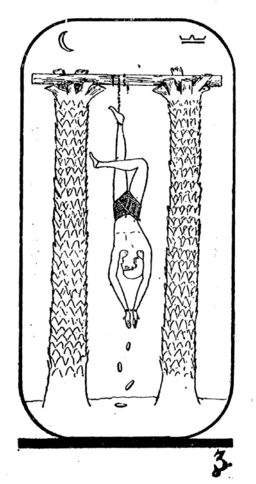

A JUnit test rule for pending tests: those which pass up to a point, and then fail in a known and, for the time being, acceptable way.

image:https://img.shields.io/bintray/v/tomwhoiscontrary/maven/homme-pendu.svg[Bintray] Get it from https://bintray.com/bintray/jcenter[JCenter] at li.earth.urchin.twic:homme-pendu

While working at https://github.com/tim-group[TIM Group], i had the pleasure of working with Tony Tsui's https://github.com/ttsui/pending[PendingRule]. This library is an attempt to implement the same idea in a slightly different way.

.The https://en.wikipedia.org/wiki/The_Hanged_Man_(Tarot_card)[hanged man] of the Egyptian tarot. Image courtesy of https://commons.wikimedia.org/wiki/File:Egyptian_Tarot_(Falconnier)_12.png[Wikimedia]
[caption=""]

As an example, let's say you're writing an application to manufacture widgets. Widgets are made in moulds of a certain size, and a widget's size matches that of its mould. You write a test to specify as much, but you aren't in a position to implement the method to get a widget's size yet; you would like to throw an exception from that method, and leave the test pending. Here's what you do:

[source,java]
----
public class WidgetTests {

    @Rule
    public final PendingTest pendingTest = new PendingTest();

    @Test
    public void sizeIsTakenFromTheMould() {
        WidgetMould widgetMould = new WidgetMould(4);
        Widget widget = widgetMould.cast();

        pendingTest.shouldFailAfterThis(instanceOf(UnsupportedOperationException.class)); // <1>
        int size = widget.getSize();
        pendingTest.shouldFailBeforeThis(); // <2>

        assertThat(size, equalTo(4));
    }

}
----
<1> The call to shouldFailAfterThis marks the start of the region of the test where failure is expected, and can optionally specify the exception with which the test fails
<2> The call to shouldFailBeforeThis marks the end of the region of the test where failure is expected

When the test runs, the rule intercepts any exception thrown from the test; if the exception thrown is from the marked region of the test, and is as specified, then it is suppressed, and the test is ignored (by treating it has having a false https://github.com/junit-team/junit4/wiki/assumptions-with-assume[assumption]). If any other exception is thrown, the test fails as usual. If no exception is thrown, the test fails - this indicates that the feature has been implemented, and the test should no longer be pending! The test also fails if the marking methods are misused.

The key difference to Tony's PendingRule is that the expected failure can be scoped to a specific region of the test, and a specific exception. This means that if a pending test is broken by unrelated changes to the code (affecting test setup, typically), it will fail, rather than erroneously passing.

The fact that pending tests are ignored rather than passing is also a significant difference.
